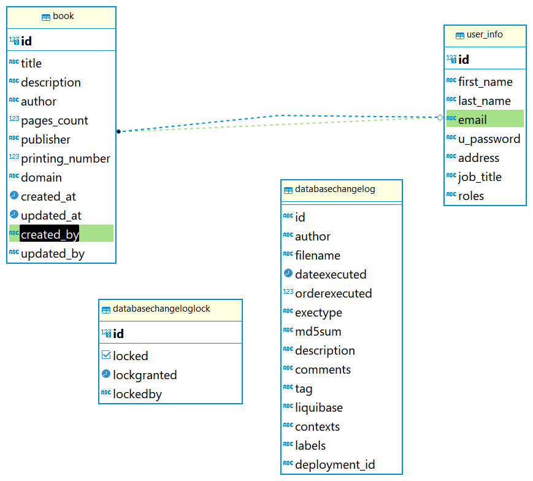
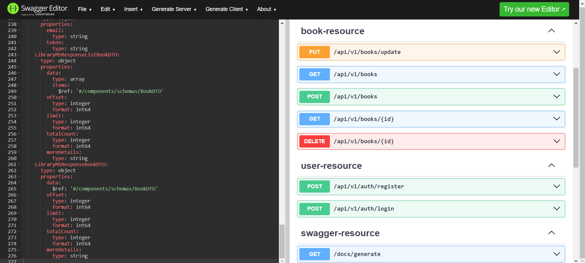

# Library Management System

### **POC Description**

-----
Building a Library Management system where users can
- **Create Book.**
- **View All Books.**
- **Get Book Using The ID.**
- **Delete book if exists.**
- **Update Book.**
- **Register new User Into the System.**
- **Login with username, password and generate JWT token.**
- **Endpoint to Generate the Swagger Documentation as a json file.**

### Documentation For RESTful Api Usage (Resources and Endpoints)

📧 https://documenter.getpostman.com/view/28448487/2sA3s6E9GQ#743abdf0-aedf-431b-9840-7fa89f5dff50

### ⚙ Used Technologies ⚙

---
* Java version 17 from (**Eclipse Adoptium**)
* Spring Boot Version (3.3.2)
* Spring Data JPA
* Apache Maven version (**3.9.3**)
* Tomcat Server (Embedded Server)
* Spring Bean Validation
* JSON-B for Binding
* Postman to test APIs
* Postgresql Database
* Liquibase As Database Migration Tool
* Spring Security
* JWT tokens
* Swagger Documentation as OpenAPI

### 🛠 Work With Maven(software project management)

---
* Configure the pom.xml file
* Deploy the application using maven with spring-boot plugin and tomcat web container.

for generating the jar file and running all test cases we can use this command

`mvn clean package spring-boot:run` used to generate the jar file 
and deploy it automatically into Tomcat Web server.

### Postgresql DataBase

---
* Adding the configuration of datasource into the application.properties file (connection String, username, password, Driver)
* Adding Liquibase Configuration to apply the changesets when the application starts.

**DataBase Tables Used**

---
*To Generate The swagger documentation file as json we can use this **curl***

After Running the Application we can use this CURL
>curl --location 'http://localhost:8090/library/docs/generate' \
--header 'Accept: */*' \
--header 'Cookie: JSESSIONID=873693D000221D656826AC111757D5EF'

After Running the API, Getting Json file, Import it to **swagger Editor** to see the APIS Like

---

- Try
`mvn clean test` to run the unit testing 

  

------
### My  Accounts (LINKEDIN, HACKERRANK)

[LinkedIn Account](https://www.linkedin.com/in/abdallah96)

[HackerRank Account](https://www.hackerrank.com/profile/abdallahsameer22)

